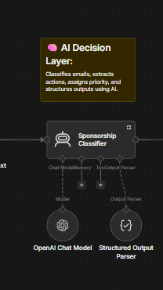
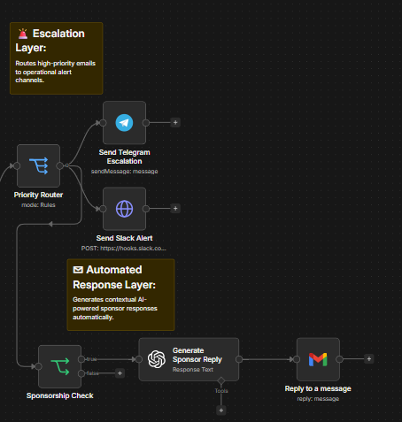
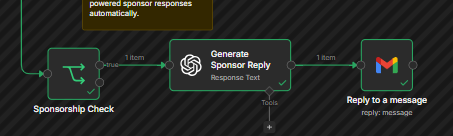
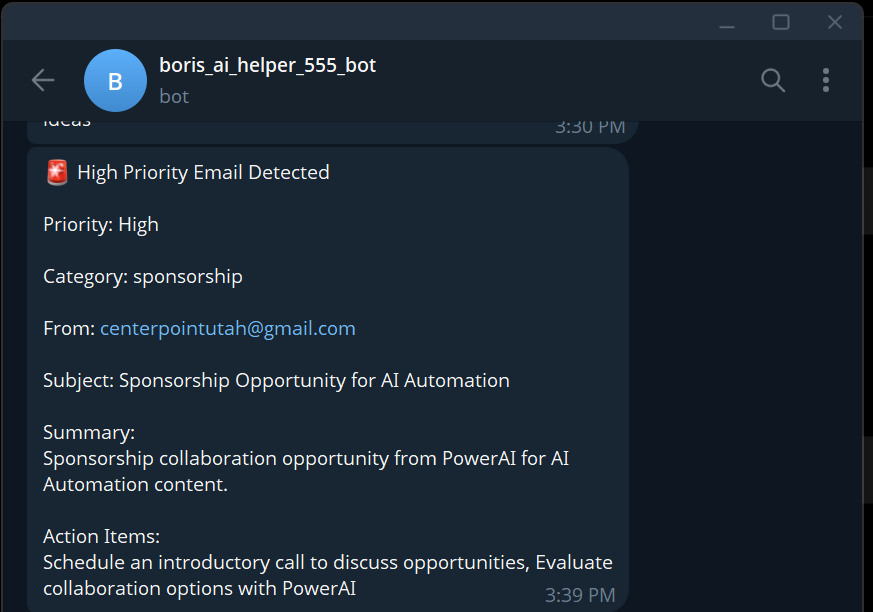
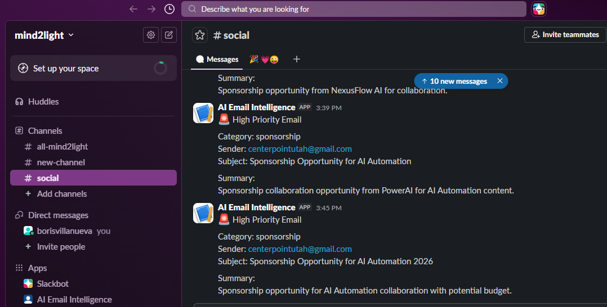
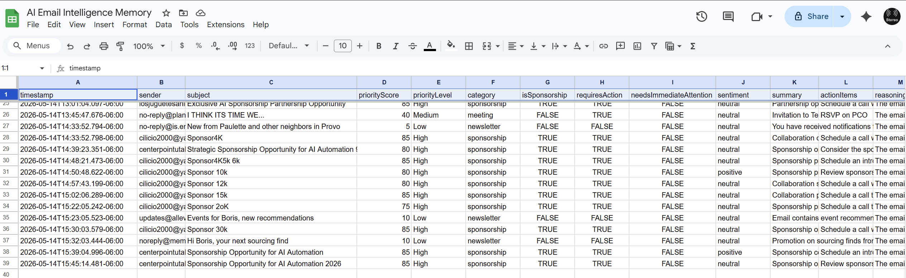
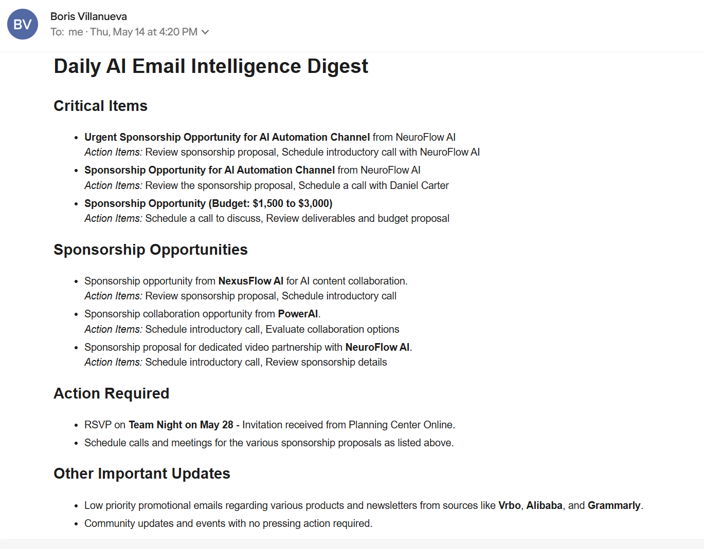
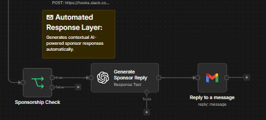
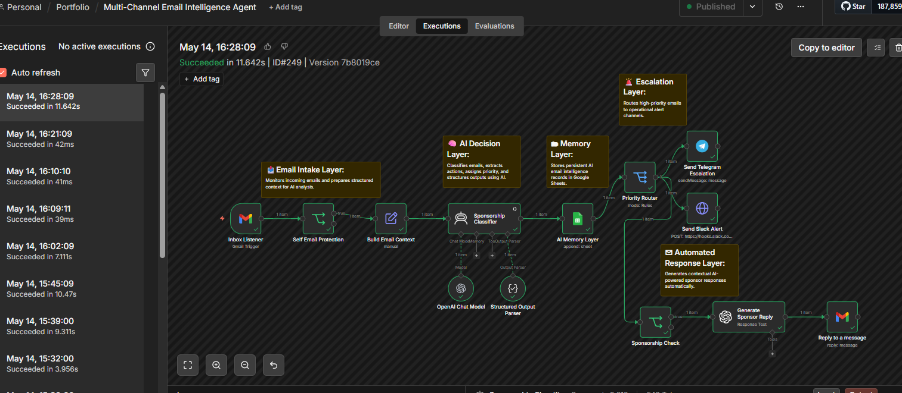

# Multi-Channel AI Email Operations

AI-powered multi-channel email operations platform built with n8n, OpenAI, Gmail, Slack, Telegram, and Google Sheets for intelligent classification, escalation, memory persistence, automated sponsor response workflows, and executive email intelligence reporting.

---

# Overview

This project demonstrates a production-style AI email operations system capable of:

- Monitoring incoming Gmail messages
- Classifying emails using AI
- Detecting sponsorship opportunities
- Routing high-priority alerts
- Sending Telegram and Slack escalations
- Persisting structured email intelligence into Google Sheets
- Automatically generating sponsorship replies
- Producing scheduled executive digest reports

The system combines real-time operational workflows with scheduled AI summarization pipelines.

---

# Workflows Included

## 1. Multi-Channel Email Intelligence Agent

Main operational workflow responsible for:

- Gmail monitoring
- AI email classification
- Priority routing
- Telegram escalation
- Slack escalation
- Sponsorship detection
- AI-generated sponsor replies
- Google Sheets memory persistence

---

## 2. Daily Email Intelligence Digest

Scheduled executive reporting workflow responsible for:

- Retrieving stored email intelligence records
- Aggregating operational email data
- AI-powered summarization
- Daily executive digest generation
- Automated digest email delivery

---

# Architecture

```text
Gmail Inbox
    ↓
Email Intake Layer
    ↓
AI Classification Layer
    ↓
Memory Persistence Layer (Google Sheets)
    ↓
Priority Routing
    ├── Telegram Alerts
    ├── Slack Alerts
    └── Sponsorship Auto-Reply
            ↓
     Gmail Threaded Response
```

---

# Technologies Used

- n8n
- OpenAI GPT-4o-mini
- Gmail API
- Slack Webhooks
- Telegram Bot API
- Google Sheets API

---

# Key Features

## AI Email Classification

The system uses OpenAI to:

- classify email categories
- assign priority scores
- detect sponsorship opportunities
- identify action items
- generate summaries
- infer sentiment

---

## Multi-Channel Escalation

High-priority emails are automatically escalated through:

- Telegram alerts
- Slack alerts

This creates a real-time operational notification system.

---

## AI Sponsorship Reply Automation

Detected sponsorship opportunities automatically trigger:

- contextual AI-generated responses
- threaded Gmail replies
- professional outreach handling

---

## Persistent Memory Layer

Structured email intelligence records are stored in Google Sheets including:

- sender
- subject
- category
- priority
- action items
- reasoning
- summaries

---

## Executive Daily Digest

A scheduled AI workflow aggregates all processed email intelligence and generates:

- executive summaries
- sponsorship opportunity tracking
- action-required reporting
- operational digest emails

---

# Screenshots

## Workflow Overview


---

## AI Classification Layer



---

## Escalation Routing



---

## Sponsor Auto Reply Workflow



---

## Telegram Escalation



---

## Slack Escalation



---

## Google Sheets Memory Layer



---

## Daily Executive Digest



---

## Generated Sponsor Reply



---

## Workflow Execution Success



---

# Repository Structure

```text
multi-channel-ai-email-operations/
│
├── README.md
├── LICENSE
├── .gitignore
│
├── workflows/
│   ├── multi-channel-email-intelligence-agent.json
│   └── daily-email-intelligence-digest.json
│
├── screenshots/
│   ├── hero-workflow-overview.png
│   ├── ai-classification-layer.png
│   ├── escalation-routing-layer.png
│   ├── sponsor-auto-reply.png
│   ├── telegram-alert-demo.png
│   ├── slack-alert-demo.png
│   ├── google-sheets-memory.png
│   ├── daily-digest-email.png
│   ├── sponsor-email-reply-demo.png
│   └── workflow-execution-success.png
│
├── docs/
│   ├── architecture-overview.md
│   ├── setup-guide.md
│   └── security-notes.md
│
└── examples/
    ├── sample-sponsorship-email.txt
    ├── sample-slack-alert.txt
    ├── sample-telegram-alert.txt
    └── sample-digest-output.txt
```

---

# Security Notes

All exported workflows have been sanitized before publication.

Removed items include:

- API keys
- OAuth tokens
- Gmail identifiers
- Telegram bot secrets
- Slack webhook secrets
- Google Sheets identifiers
- Internal execution metadata

---

# Future Improvements

- CRM integration
- Multi-agent orchestration
- Sentiment trend analytics
- AI priority learning
- Voice notification support
- Knowledge base enrichment
- Dashboard analytics
- Human approval workflows

---

# Author

Boris Villanueva

GitHub:
https://github.com/borisvillanueva

